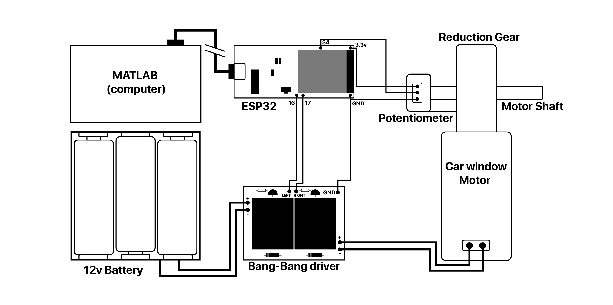
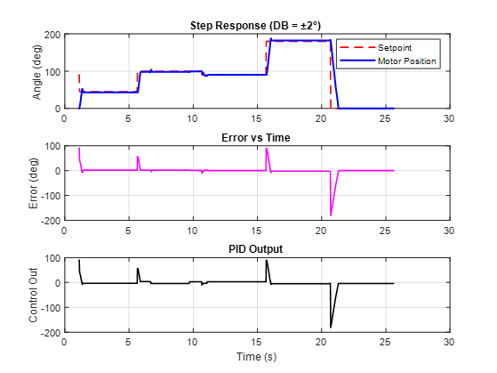

# ESP32 PID Servo (Car Window Motor Conversion)

This project shows how to convert a **car window DC motor** into a servo motor using an **ESP32**, a **potentiometer for feedback**, and a simple **bang-bang motor driver** (two digital inputs: left/right).  
The ESP32 runs a PID loop and communicates with MATLAB for data visualization and live parameter tuning.

---

## 1. Hardware Setup

### Components
- **ESP32 DevKit board**
- **Car window DC motor**
- **Motor driver with two digital control inputs** (e.g. two relays or equivalent ON/OFF circuit)
- **Potentiometer (270° rotation)** mechanically coupled to the motor shaft
- **Power supply** for the DC motor (separate from ESP32 5V USB supply)
- **Common ground** between motor driver and ESP32

### Pin Connections
| ESP32 Pin | Function                  |
|-----------|---------------------------|
| GPIO 34   | Potentiometer feedback (ADC) |
| GPIO 16   | Motor LEFT command        |
| GPIO 17   | Motor RIGHT command       |
| GND       | Shared with driver & potentiometer |
| 3.3V      | Potentiometer VCC         |

### Wiring Diagram

---

## 2. Software Setup

### ESP32 Firmware
- Open `esp32_pid_servo.ino` in Arduino IDE or PlatformIO.
- Select your ESP32 board and COM port.
- Flash the firmware.

The firmware does:
- Reads motor angle from potentiometer (scaled to 0–270°).
- Runs PID loop to reduce error between setpoint and current angle.
- Drives motor with ON/OFF signals (`LEFT` / `RIGHT`).
- Prints telemetry over serial in CSV-like format:
T,<time_ms>,SP,<setpoint>,POS,<position>,ERR,<error>,OUT,<output>

It also listens for serial commands:
- `SP <value>` → set new target angle (0–270)
- `KP <value>` → update proportional gain
- `KI <value>` → update integral gain
- `KD <value>` → update derivative gain
- `DB <value>` → update deadband (tolerance in degrees)

---

### MATLAB Script
- Open `esp32_live_plot.m` in MATLAB.
- Set your COM port (e.g. `COM9`).
- Run the script.

The script will:
1. Connect to ESP32 over serial.
2. Send a predefined sequence of setpoints:
0° → 45° → 100° → 90° → 180° → back to 0°

3. Continuously plot **setpoint vs motor position**.
4. Allow live tuning of `Kp`, `Ki`, `Kd`, and `deadband` directly from MATLAB.
5. Save test logs into a CSV file for later analysis.

---

## 3. How to Run

1. **Wire the circuit** according to the table above.  
2. **Flash ESP32** with `esp32_pid_servo.ino`.  
3. **Open MATLAB** and run `esp32_live_plot.m`. 
4. Watch the real-time plot as the motor follows the step sequence.  
5. Adjust PID and deadband values from MATLAB until the response is stable.  

---

## 4. PID Tuning Tips

- Start with only **P** → motor follows setpoint but may oscillate.  
- Add small **I** → removes offset error.  
- Add small **D** → reduces overshoot.  
- Adjust **deadband** to stop constant hunting around target (e.g. ±2°).  

---
### Result from MATALB

